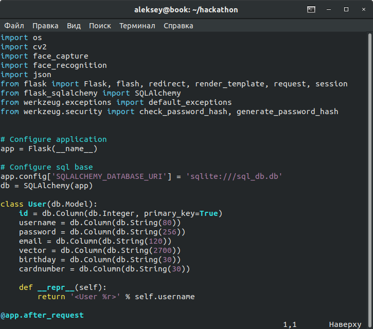

# HAKATON #KAKAO_TEAM

Система распознования лиц для коммерческих целей.


Суть проекта заключается в упрощении реализации скидочных услуг клиентам. При регистрации клиента **в базу** магазина отправляются личные данные **(Ф.И.О, Почта, Дата рождения, Номер скидочной карты для магазина)** , которые в последствии могут быть получены через фотографию клиента у самой кассы.

**Язык проекта -  [`Python`],  бэкенд - Flask/jinja , БД - SQLlite3, фронт - HTML/CSS**

Список импортированных модулей:




## Запуск
```
flask start;
В браузере идем на localhost:5000
```
##  Использование

Перед вами встанет выбор между опцией для **клиента** и для **компании**


##  Страница для клиента

 
  
```
Загружается информация о пользователе и его фото в базу.
```
##  Страница для компании

 
  
```
Вывод результата для компании (кассира)
```
## Над проектом работали:
  gstiedem
  ksnow-be
  vferry
  lsandor-
  bkiehn
