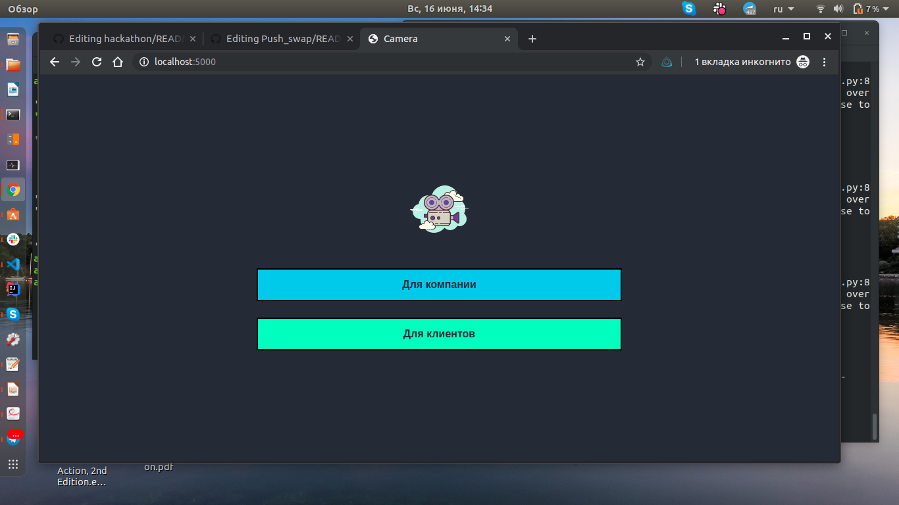
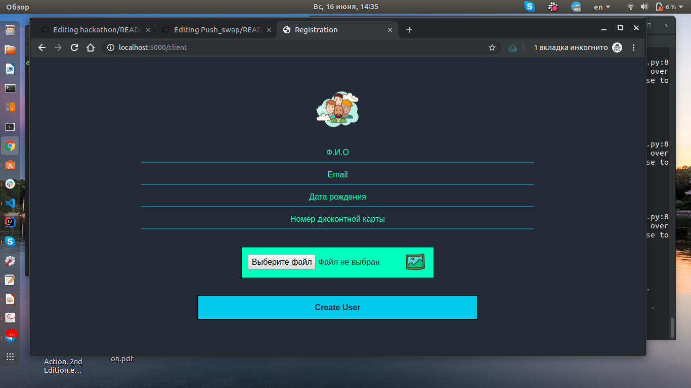
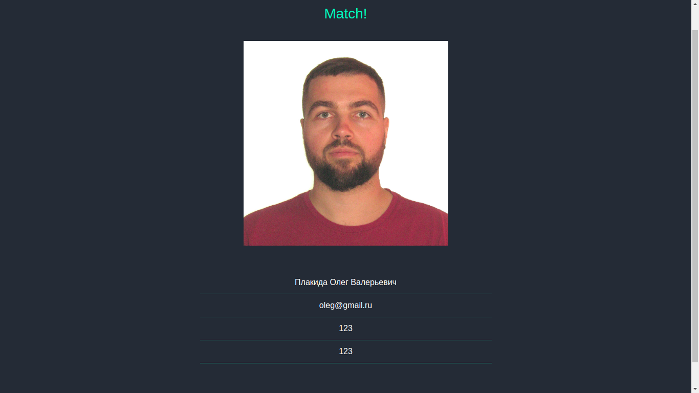

# HAKATON #KAKAO_TEAM

Система распознования лиц для коммерческих целей.


Суть проекта заключается в упрощении реализации скидочных услуг клиентам. При регистрации клиента **в базу** магазина отправляются личные данные **(Ф.И.О, Почта, Дата рождения, Номер скидочной карты для магазина)** , которые в последствии могут быть получены через фотографию клиента у самой кассы.


| Инструмент | Описание |
| --- | --- |
| Язык проекта | Python |
| Бэк | Flask, Jinja |
| БД | SQLlite3 |
| Фронт | Bootstrap/CSS |

Список импортированных модулей:

```
import os
import cv2
import face_capture
import face_recognition
import json
from flask import Flask, flash, redirect, render_template, request, session
from flask_sqlalchemy import SQLAlchemy
from werkzeug.exceptions import default_exceptions
from werkzeug.security import check_password_hash, generate_password_hash
```


## Запуск
```
flask run; <browser>localhost:5000
```
##  Использование

Перед вами встанет выбор между опцией для **клиента** и для **компании**



##  Страница для клиента

 
  
```
Загружается информация о пользователе и его фото в базу.
```
##  Страница для компании

 
  
```
Вывод результата для компании (кассира)
```
## Над проектом работали:
  gstiedem
  ksnow-be
  vferry
  lsandor-
  bkiehn
